# Configure Authentication and Authorization

1. Create an Auth0 account at auth0.com

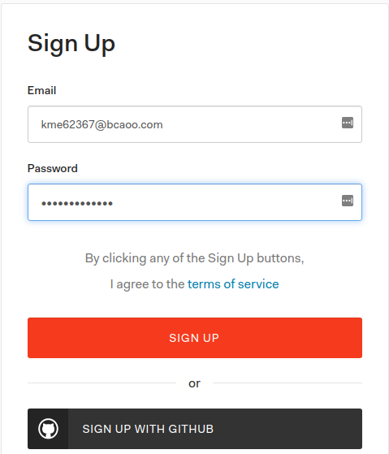

2. While signing up, we would be creating a domain (e.g. `projectname.auth0.com`).

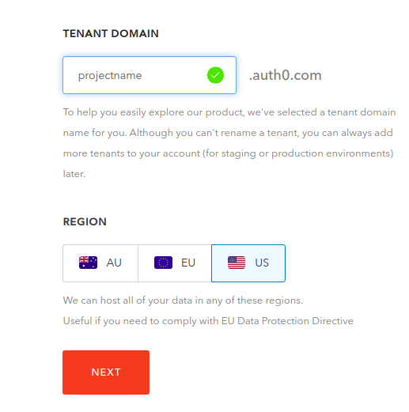

3. Under `Applications` to create new app, click on `Create Application` and give it a name (`projectname`). Select `Single Page Web Application` (SPA).

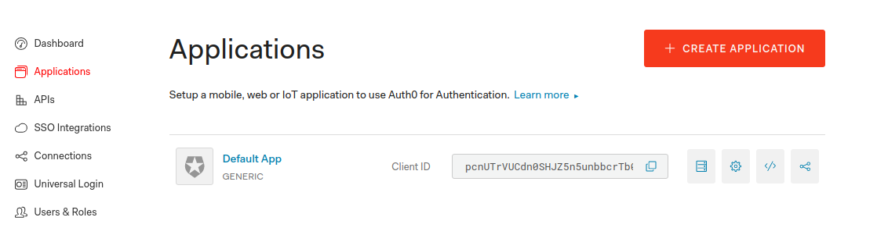
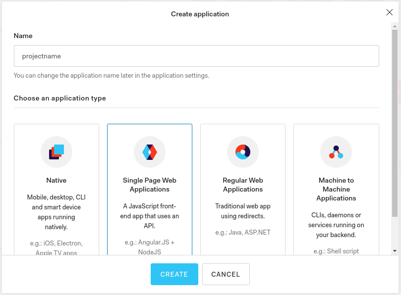

4. Under the current app's `settings` tab, scroll down and click on `Show Advanced settings` and click on `Certificates` to get the public key with which the serverless service is going to sign the tokens.
Copy the contents on signing `Signing Certificate` and paste in a local file named `public_key` in the project folder.

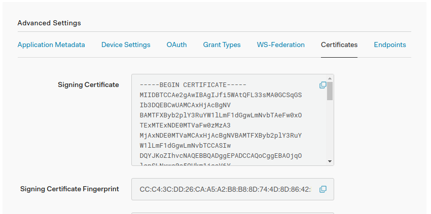

5. Click on `Grant Types` and check `Password`, uncheck all the other grant types and save changes.

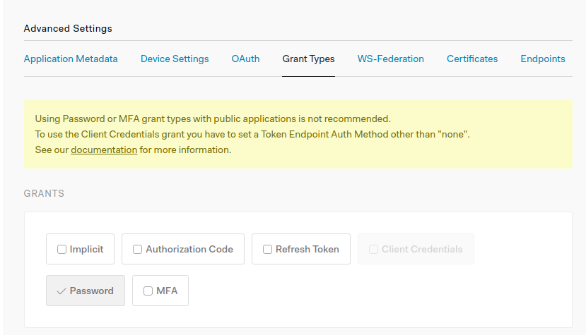

6. To configure the database to be used, click on `Connections > Database` and click on the default database `Username-Password-Authentication`.

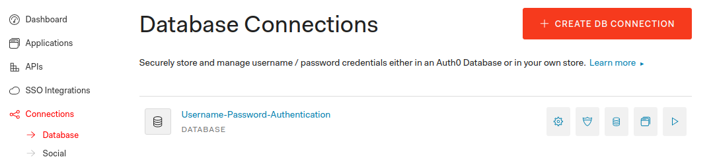

a. Settings like min and max password length, password policy, can be configured here.

b. Under applications tab we should see `projectname` enabled, if not please `enable` application.

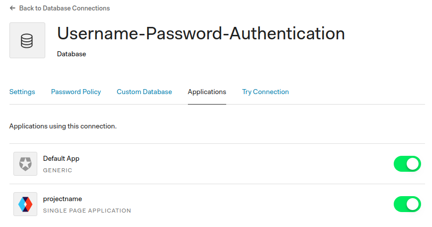

c. clicking `Try connection` should work with a login screen.

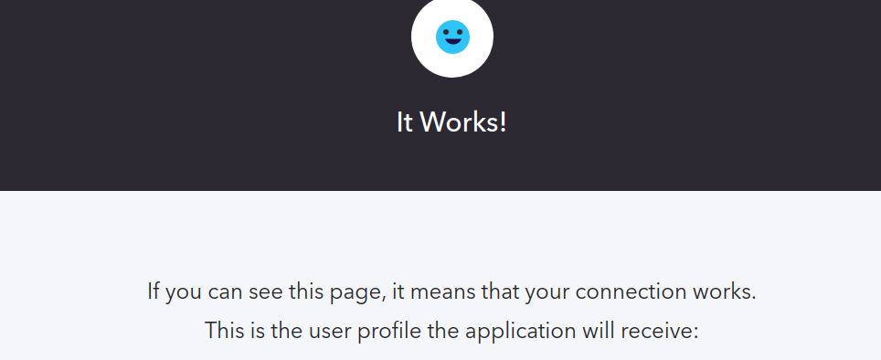

7. To make password grant work, we have to set `Default Audience` and `Default Directory`, to do that:

a. Go to account settings (top right under your username)

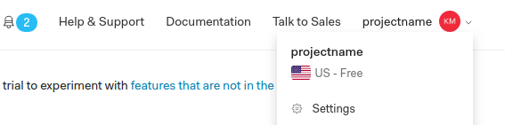

b. On the general tab scroll down to the API Authorization Settings section

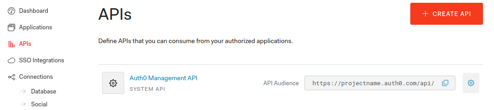

c. Default Audience would be your API identifier. This can be found under `APIs > Auth0 Management API`. `API Audience` is the identifier (`https://projectname.auth0.com/api/v2/`) 

d. Default Directory would be your connection such as database connection name (`Username-Password-Authentication`)

e. Paste values and save.
Ref: https://stackoverflow.com/questions/41626602/how-to-make-a-username-password-request-with-auth0-custom-api-getting-error-un

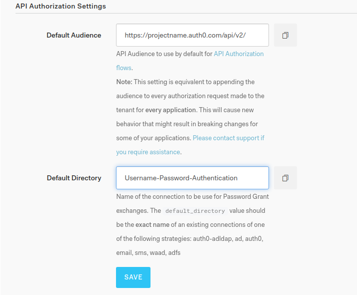

8. CORS URLs: Under `Applications > projectname > Settings` scroll down to `Allowed Origins (CORS)` and enter any valid URL from which Auth0 endpoints are accessed (`http://localhost:8080/signin`).

Allowed Origins are URLs that will be allowed to make requests from JavaScript to Auth0 API (typically used with CORS). By default, all your callback URLs will be allowed.

Leave it empty, if you are in development.

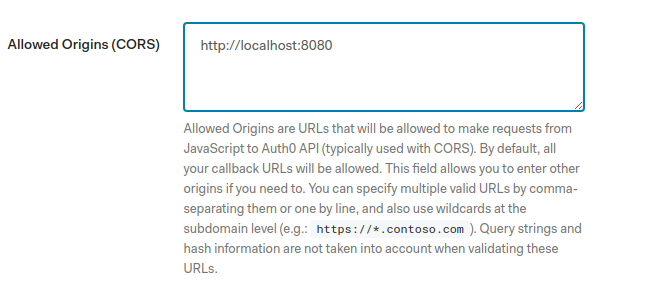

9. To enable users ability to create/delete their accounts, we need to setup another application which is a machine-to-machine application. To do that:

 a. Click on applications and create a new application

 b. Name it (`projectname-management`), select application type to be `machine-to-machine` (M2M), select `Auth0 API` and add scopes. Required scopes are `update:users, delete:users, create:users, read:users`.
 
 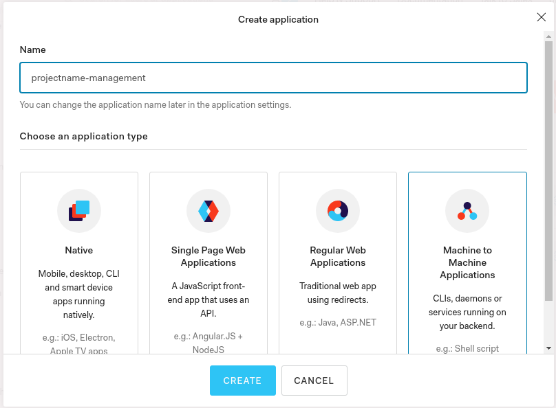
 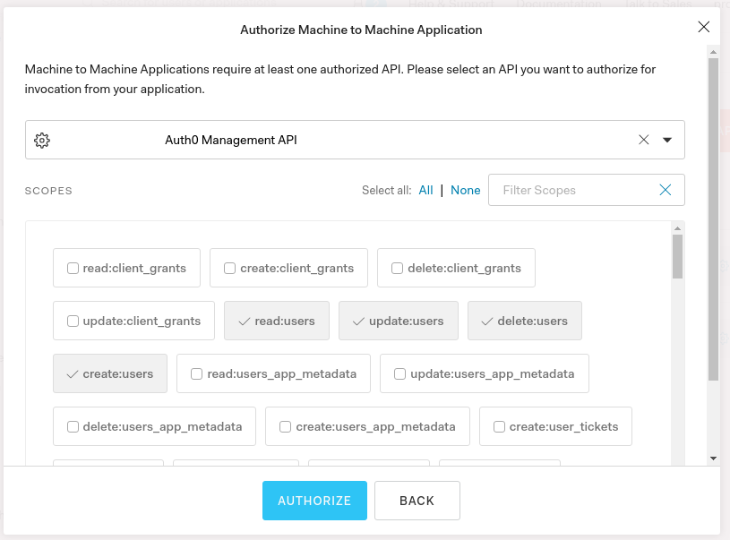
 
 
 10. Copy credentials like SPA client_id, client_secret, M2M client_id, client_secret, audience, domain, certificate from Auth0 to your `config.{stage}.json` file.